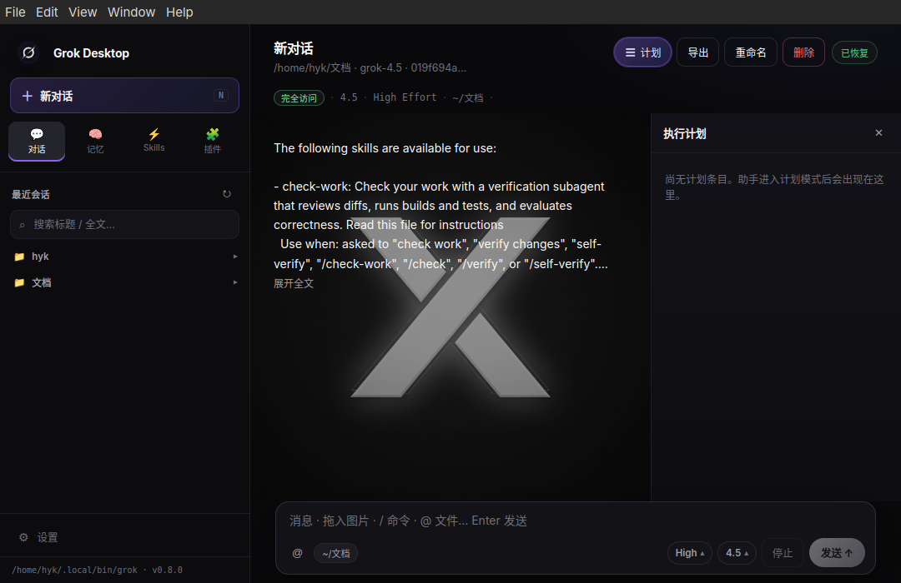
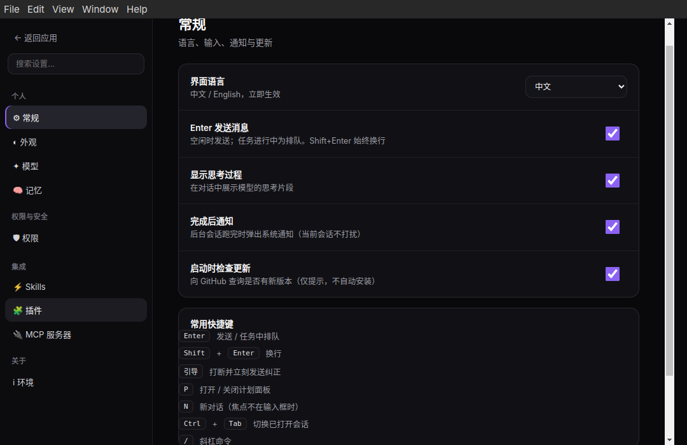
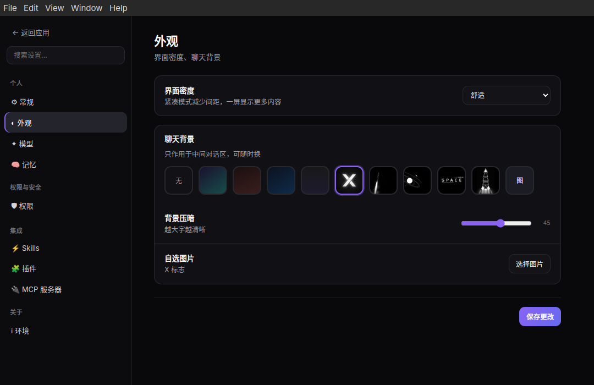

# Grok Desktop

<p align="center">
  
</p>

<p align="center">
  <strong>A focused desktop workspace for the official Grok CLI</strong><br />
  <strong>基于官方 Grok CLI 的跨平台桌面工作区</strong>
</p>

<p align="center">
  维护者 · Maintainer：<strong>luofanglei</strong><br />
  <a href="mailto:1551180125@qq.com">1551180125@qq.com</a> ·
  <a href="https://github.com/luofanglei1-ctrl">@luofanglei1-ctrl</a>
</p>

<p align="center">
  Windows 11 / 10 · Linux · 多会话 · 计划 / 目标模式 · Diff · MCP · Skills · 中文 / English
</p>

<p align="center">
  <a href="https://github.com/luofanglei1-ctrl/grok-desktop/releases/latest">
    
  </a>
  <a href="https://github.com/luofanglei1-ctrl/grok-desktop/releases/latest">
    
  </a>
</p>

<p align="center">
  
  
  
  
</p>

<p align="center">
  <a href="#中文">中文</a> ·
  <a href="#english">English</a> ·
  <a href="https://github.com/luofanglei1-ctrl/grok-desktop/releases">全部版本 / Releases</a> ·
  <a href="https://github.com/luofanglei1-ctrl/grok-desktop/issues">问题反馈 / Issues</a>
</p>


> [!IMPORTANT]
> Grok Desktop 是社区项目，不是 xAI 官方产品。它不内置账号或模型服务，而是连接你电脑上已经安装并登录的官方 `grok` CLI。<br />
> Grok Desktop is a community project, not an official xAI product. It uses the official `grok` CLI installed and authenticated on your computer.

---

<a id="中文"></a>

## 中文

### 一眼看懂

Grok Desktop 把官方 Grok CLI 的 Agent 能力放进适合长期工作的独立窗口。支持多会话并行、计划模式、目标模式、文件 Diff、模型/强度切换、权限策略，以及 CLI 已有的 MCP、插件、Skills 与记忆。

它不是网页聊天套壳，也不会替换官方 CLI：

- **Agent 后端**：官方 `grok agent`，通过 ACP 通信。
- **账号与额度**：继续由官方 Grok CLI 和 xAI 账号管理。
- **会话与配置**：保存在本机。
- **支持平台**：Windows x64、Linux x64。

### 界面预览



<table>
  <tr>
    <td width="50%">
      <strong>多会话工作区</strong><br />
      项目分组、运行状态、历史搜索和完成后通知集中在左侧。
    </td>
    <td width="50%">
      <strong>计划 / 目标与上下文</strong><br />
      在同一窗口查看计划进度、目标推进、工具调用、文件差异和 Agent 输出。
    </td>
  </tr>
  <tr>
    <td colspan="2">
      
    </td>
  </tr>
</table>

### 设置中心

设置页可管理语言、发送方式、完成后通知、开机自启、更新、外观（密度 / 缩放 / 壁纸）、模型、记忆、权限、Skills、插件、MCP，以及**环境**（开发者信息与本机诊断）。

<table>
  <tr>
    <td width="50%">
      
    </td>
    <td width="50%">
      
    </td>
  </tr>
  <tr>
    <td align="center"><strong>常规设置</strong><br />语言、发送、思考、通知、开机自启、更新</td>
    <td align="center"><strong>外观设置</strong><br />密度、界面缩放（1080p / 2K / 4K）、聊天背景</td>
  </tr>
</table>

### 核心功能（1.0.1）

| 功能 | 说明 |
|---|---|
| **多会话并行** | 同时运行多个 Agent；切换页签不中断后台；侧栏显示运行中 / 已完成。 |
| **会话管理** | 新建、恢复、重命名、删除；按工作目录分组；搜索标题与全文。 |
| **+ 添加菜单** | 输入框左侧 `+` 向上弹出：附加文件/文件夹、图片；切换任务 / 计划 / 目标模式。 |
| **任务模式** | 默认执行与改代码（对应日常 Agent 工作流）。 |
| **计划模式** | 对齐官方 `/plan`：先探索与设计，再改代码；支持 ACP `session/set_mode` 与斜杠回退；侧栏 Offcanvas 计划面板。 |
| **目标模式** | 对齐官方 `/goal`：在对话框直接输入目标并发送，无需二次弹窗；标签上可看状态 / 暂停 / 恢复 / 清除；实时 `goal_updated`。 |
| **排队与引导** | 运行中 Enter 排队；「引导」打断并立即发送修正。 |
| **文件 Diff** | 工具改文件时展示行级差异（含悬停预览与汇总）。 |
| **模型与思考强度** | 使用 CLI 返回的模型列表与强度选项。 |
| **权限模式** | 审批 / 智能 / 完全访问。 |
| **完成后系统通知** | 对话轮次或目标完成时弹出系统通知 + 应用内 Toast（可在设置关闭）。 |
| **开机自启** | 登录系统时自动启动（安装包更可靠）。 |
| **多分辨率适配** | 侧栏 / 对话宽度 / 字号随窗口与 1080p·2K·4K 缩放。 |
| **浮层 UI** | 弹窗 / Toast / 抽屉基于 Bootstrap + GrokUI，不挤占页面布局。 |
| **MCP / 插件 / Skills / 记忆** | 复用官方 CLI 配置。 |
| **中英界面** | 设置中切换，即时生效。 |

### 「+」菜单与模式

1. 点击输入框左侧 **+**（菜单在按钮**上方**展开）。
2. **文件和文件夹 / 图片**：附加到本轮对话。
3. **目标**：进入目标模式 → 在输入框写目标 → Enter 发送（`/goal <内容>`）。
4. **任务模式 / 计划模式**：切换执行风格；计划模式可打开计划面板。
5. 目标进行中时，输入框上方标签可操作：**状态 · 暂停 · 恢复 · 清除**（悬停显示完整名称）。

### 排队与「引导」

Agent 工作时：

1. 输入补充要求并 **Enter** → 进入队列。
2. 可继续编辑或删除队列消息。
3. 点击 **引导** → 中断当前步骤并立即发送。


### 权限模式

| 模式 | 行为 | 建议场景 |
|---|---|---|
| **审批** | 写文件 / 跑命令前确认。 | 陌生仓库、审查、高风险。 |
| **智能** | 常规自动，高风险询问。 | 日常开发（推荐）。 |
| **完全访问** | 默认批准工具操作。 | 完全可信的本机项目。 |

在 **设置 → 权限** 中修改。

### 安装前准备

```powershell
grok --version
grok login
```

若 CLI 不可用，请先按 [x.ai/cli](https://x.ai/cli) 安装并登录。桌面版不包含 CLI，也不绕过官方登录。

### Windows 安装

从 [最新 Release](https://github.com/luofanglei1-ctrl/grok-desktop/releases/latest) 下载：

| 文件 | 说明 |
|---|---|
| `Grok-Desktop-1.0.4-Windows-Setup-x64.exe` | 推荐安装版（开始菜单 / 桌面快捷方式）。 |
| `Grok-Desktop-1.0.4-Windows-Portable-x64.exe` | 免安装便携版。 |

首次使用：确认 CLI → `grok login` → 启动桌面版 → 完成环境检测 → **新对话** 选择工作目录。

> [!NOTE]
> 若安装包未签名，SmartScreen 可能提示「未知发布者」，请确认文件来自本仓库 Release。

找不到 CLI 时，可设置：

```powershell
setx GROK_CLI "C:\完整路径\grok.exe"
```

### Linux 安装

```bash
sudo dpkg -i linux-grok-desktop_1.0.1_amd64.deb
sudo apt-get install -f
```

### 从源码运行

需要 Node.js 18+、npm，以及已登录的官方 Grok CLI。

```bash
git clone https://github.com/luofanglei1-ctrl/grok-desktop.git
cd grok-desktop
npm install
npm start
```

打包：

```bash
npm run dist:win       # Windows 安装包 + 便携版
npm run dist:deb       # Debian
npm run dist:appimage  # AppImage
```

### 架构

```text
Grok Desktop
  ├─ Electron 主进程：会话池、IPC、系统通知、更新检查、开机自启
  ├─ Renderer：对话、+ 菜单、计划/目标、Diff、设置、Bootstrap/GrokUI 浮层
  ├─ ACP 客户端：与 grok agent 结构化通信
  └─ 官方 Grok CLI：登录、模型、会话、工具、MCP
```

品牌与环境页信息见 `src/brand.js`（作者、邮箱、仓库链接等）。

### 数据与隐私

- 登录与额度由官方 CLI 管理。
- 桌面设置仅保存在本机用户配置目录。
- 不会要求在界面粘贴 xAI 密码或令牌。
- 高权限模式仅在可信环境使用。

### 常见问题

<details>
<summary><strong>创建失败 / 请先登录官方 CLI</strong></summary>

同一系统用户下执行 `grok --version` 与 `grok login`。若终端正常而应用找不到 CLI，设置 `GROK_CLI` 后重启。
</details>

<details>
<summary><strong>对话完成没有系统通知？</strong></summary>

1. **设置 → 完成后通知** 保持开启。  
2. Windows 通知中心允许桌面应用通知；关闭专注助手拦截。  
3. 重启应用后再试；应用内也会有 Toast。  
4. 开发模式（`electron .`）在部分 Windows 上系统通知不稳定，安装包更可靠。
</details>

<details>
<summary><strong>Enter 没有立刻打断 Agent？</strong></summary>

运行中 Enter 为排队；使用「引导」才会中断并立即发送。
</details>

<details>
<summary><strong>计划 / 目标面板是空的？</strong></summary>

计划需 Agent 产出计划条目；目标需通过 **+ → 目标** 并在输入框发送目标文本。
</details>

### 维护者

详见 [docs/ABOUT.md](./docs/ABOUT.md)。

| 项 | 内容 |
|----|------|
| 作者 | **luofanglei** |
| 邮箱 | [1551180125@qq.com](mailto:1551180125@qq.com) |
| GitHub | [@luofanglei1-ctrl](https://github.com/luofanglei1-ctrl) |
| 仓库 | https://github.com/luofanglei1-ctrl/grok-desktop |
| 品牌配置 | `src/brand.js`（应用内「设置 → 环境」同步展示） |

---

<a id="english"></a>

## English

### Overview

Grok Desktop turns the official Grok CLI agent into a focused desktop workspace: parallel sessions, **plan mode**, **goal mode**, file diffs, models, permissions, MCP, plugins, Skills, and memory — without replacing the official CLI.

### Highlights in 1.0.1

| Feature | Details |
|---|---|
| **+ menu** | Attach files/folders & images; switch Task / Plan / Goal modes (menu opens upward). |
| **Plan mode** | Official-style planning via `session/set_mode` / `/plan`, Offcanvas plan panel. |
| **Goal mode** | Official `/goal`: type the objective in the composer (no extra dialog); chip actions for status / pause / resume / clear. |
| **Done notifications** | OS notification + in-app toast when a chat turn or goal finishes. |
| **Open at login** | Optional autostart on sign-in. |
| **Responsive UI** | Layout and type scale for 1080p / 2K / 4K; Bootstrap + GrokUI overlays without reflow. |
| **About / brand** | Environment page shows maintainer info from `src/brand.js`. |

### Install

**Prerequisite:** [x.ai/cli](https://x.ai/cli) installed and `grok login`.

**Windows:** download Setup or Portable from [Releases](https://github.com/luofanglei1-ctrl/grok-desktop/releases/latest).

**From source:**

```bash
git clone https://github.com/luofanglei1-ctrl/grok-desktop.git
cd grok-desktop
npm install
npm start
```

```bash
npm run dist:win
npm run dist:deb
npm run dist:appimage
```

### How it works

```text
Grok Desktop
  ├─ Electron main: sessions, IPC, notifications, updates, login item
  ├─ Renderer: chat, + menu, plan/goal, diffs, settings, Bootstrap/GrokUI
  ├─ ACP client: structured agent protocol
  └─ Official Grok CLI: auth, models, tools, MCP
```

### Privacy

Auth stays with the official CLI. Desktop settings are local only. Do not use Full access on untrusted projects.

### Maintainer

- **luofanglei** · [1551180125@qq.com](mailto:1551180125@qq.com)
- GitHub: [@luofanglei1-ctrl](https://github.com/luofanglei1-ctrl)
- Issues: https://github.com/luofanglei1-ctrl/grok-desktop/issues

### Project notice

- Maintained by **luofanglei** — independent from xAI.
- Grok, xAI, and related names belong to their owners.
- Contact: [1551180125@qq.com](mailto:1551180125@qq.com) · [GitHub Issues](https://github.com/luofanglei1-ctrl/grok-desktop/issues)

---

## 版本更新说明 / Changelog

| 文档 | 说明 |
|------|------|
| [CHANGELOG.md](./CHANGELOG.md) | 完整版本变更记录 |
| [docs/RELEASE_v1.0.4.md](./docs/RELEASE_v1.0.4.md) | **v1.0.4 GitHub Release 正文** |
| [docs/RELEASE_v1.0.3.md](./docs/RELEASE_v1.0.3.md) | v1.0.3 发布说明 |
| [docs/ABOUT.md](./docs/ABOUT.md) | 维护者与品牌信息 |
| [docs/THEME-SWITCH-DESIGN.md](./docs/THEME-SWITCH-DESIGN.md) | **主题切换设计**（深色 / 普通浅色，待实现） |

### 1.0.4 摘要

- 修复退出再打开仍弹出旧「任务完成」提示

### 1.0.3 摘要

- 深色 / 普通主题；上下文用量；自动/手动压缩（静默）  

---

<p align="center">
  <strong>Grok Desktop 1.0.4</strong><br />
  Windows &amp; Linux · Official Grok CLI<br />
  by <strong>luofanglei</strong> ·
  <a href="https://github.com/luofanglei1-ctrl/grok-desktop">luofanglei1-ctrl/grok-desktop</a>
</p>
